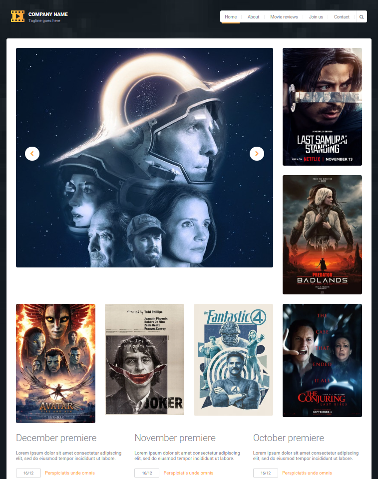
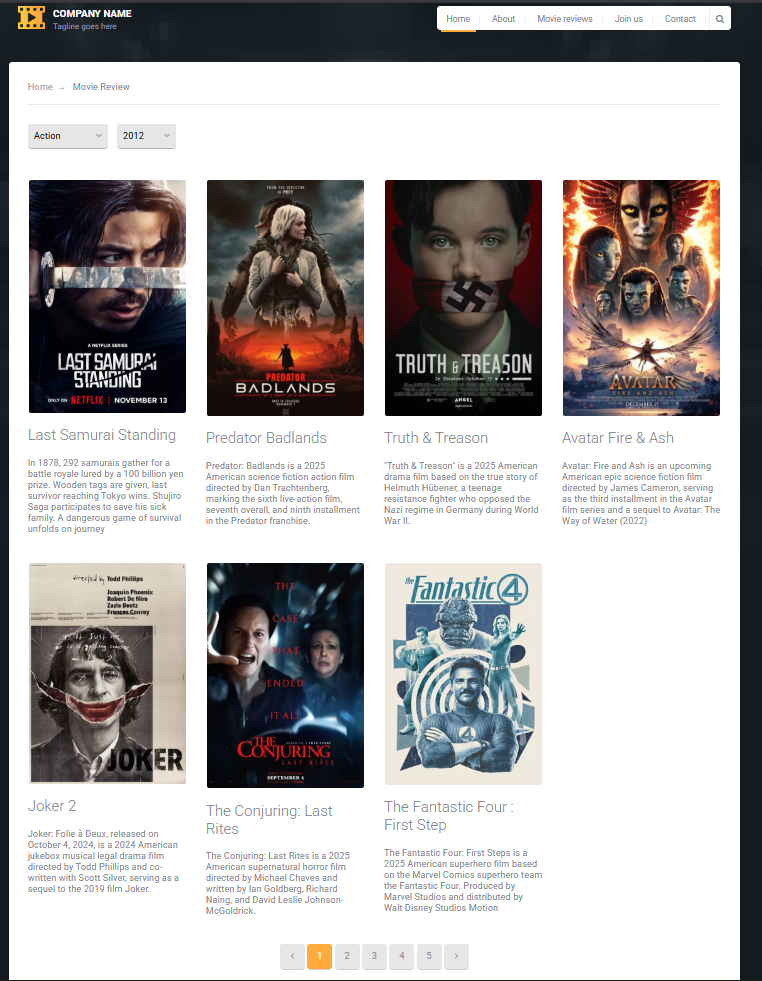
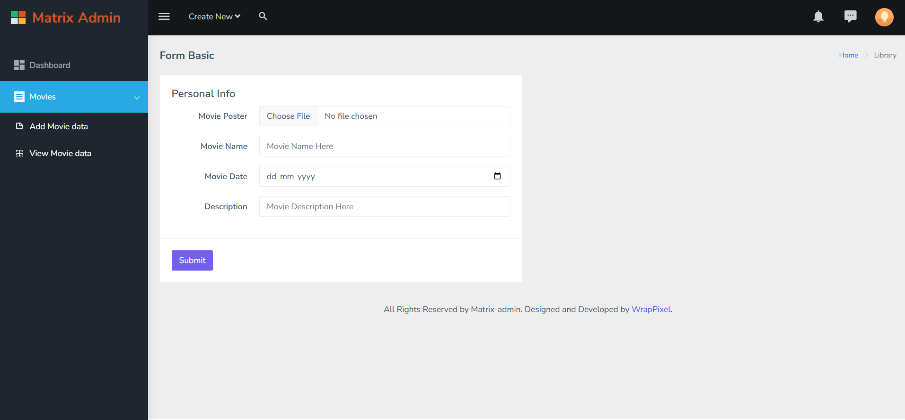
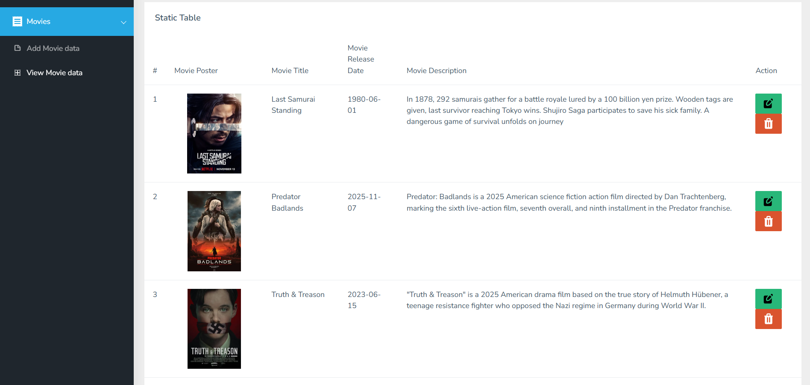

# Movie Review System

A full-stack Node.js application with admin and client interfaces for movie management and reviews.

## Features

### 🎬 Client Side Features
- Browse movie catalog
- View detailed movie information
- Responsive design
- Search functionality
- User-friendly interface

### 👨‍💼 Admin Features
- Complete CRUD operations for movies
- Image upload and management
- Admin dashboard
- Movie data management
- Secure admin panel

## Tech Stack

### Backend
- Node.js
- Express.js
- MongoDB
- Multer (image handling)

### Frontend
- EJS templating
- Bootstrap
- Custom CSS

## Installation

1. **Clone the repository**
```bash
git clone <repository-url>
cd Node-Movie-PR
```

2. **Install dependencies**
```bash
npm install
```

3. **Configure environment variables**
Create `.env` file:
```env
MONGODB_URL = "mongodb://localhost:27017/MoviesDB"
PORT = 8081
```

4. **Start the server**
```bash
npm run dev
```

## Screenshots

### Client Interface

#### Homepage View

*Main landing page displaying featured movies*

#### Movie Details

*Detailed movie information page for users*

### Admin Dashboard

#### Movie Management

*Admin control panel for movie management*

#### Data Entry

*Movie information input interface for administrators*

## Project Structure
```
Node-Movie-PR/
├── config/          # App configuration
├── controllers/     # Route controllers
│   ├── client/     # Client-side controllers
│   └── server/     # Admin controllers
├── middlewares/    # Custom middlewares
├── models/         # Database schemas
├── public/         # Static assets
├── router/         # Route definitions
├── uploads/        # Stored images
├── views/          # EJS templates
│   ├── client/     # Client views
│   └── server/     # Admin views
└── index.js        # App entry point
```

## API Routes

### Client Routes
- `GET /` - Homepage
- `GET /movies` - Movie listing
- `GET /movie/:id` - Single movie view

### Admin Routes
- `GET /admin` - Admin dashboard
- `POST /admin/movies` - Add new movie
- `PUT /admin/movies/:id` - Update movie
- `DELETE /admin/movies/:id` - Delete movie

## Contributing
Pull requests are welcome. For major changes, please open an issue first.

## License
[ISC](https://choosealicense.com/licenses/isc/)